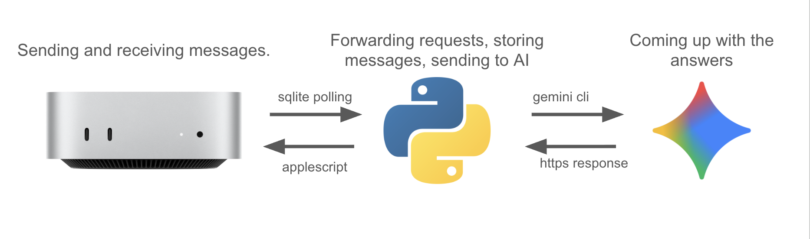

# iMessages Chatbot Server

iMessage has no public API. This project provides a high-performance solution by turning any macOS device into a headless iMessage gateway for large language models/automated messaging. It uses an asynchronous Python server that programmatically controls the native Messages app, achieving what Apple doesn't natively support: read receipts, typing indicators, and concurrent AI conversations over the iMessage network.

For a deep dive into the architecture and the challenges of taming iMessage, **check out our full write-up on the blog!** `[<-- LINK YOUR BLOG POST HERE]`

## How It Works

The whole system is a simple, powerful loop. Our Python server constantly watches the local Messages database for new messages. When one comes in, it grabs the content, bundles it with the conversation history, and sends it off to the Gemini API. Once Gemini replies, the server uses AppleScript to type and send the response right back through the Messages app.



## Key Features

*   **Handles a Crowd:** Comfortably manages up to 20 conversations at the same time without breaking a sweat.
*   **Feels Human:** Long AI responses are automatically split into separate paragraphs, with a realistic typing delay between each one to feel more natural.
*   **Smart Replies:** If someone sends a bunch of messages in a row, the bot waits a moment (a 0.3s debounce) to reply to the whole thought, not just the first part.
*   **Remembers a Conversation:** Never loses track. The bot remembers past messages using a simple SQLite database, so every chat has context.
*   **Real-time Feedback:** Shows the "..." typing indicator and marks messages as read, making the conversation feel alive and responsive.

## Technical Stack

*   **Runtime**: Python 3.8+ using `asyncio` for a non-blocking event loop.
*   **AI Backend**: Google's Gemini Pro model, accessed via its official API.
*   **Message I/O**: Reads directly from the `chat.db` SQLite file on macOS and writes responses using AppleScript automation.
*   **Concurrency**: Manages simultaneous API calls with a semaphore, while a lock ensures messages are sent one-by-one to the GUI.

## Performance

Here's what you can expect in terms of performance on a standard Mac Mini:

| Metric | Value |
| :--- | :--- |
| **Optimal Capacity** | 15-20 concurrent users |
| **Internal Latency** | Under 2 seconds (excluding AI processing time) |
| **AI Response Time** | ~1.5s average, 0.8s standard deviation |
| **Message Throughput** | ~10-15 messages per minute, sustained |

---

## Installation Guide

### 1. Clone or Download the Repository

```bash
cd ~/Documents
git clone <repository-url> hack-coms-therapy
cd hack-coms-therapy
```

### 2. Install Python Dependencies

```bash
python3 -m pip install -r requirements.txt
```

### 3. Configure Environment Variables

Create a `.env` file in the project directory:

```bash
touch .env
```

Edit `.env` and add your configuration:

```env
GEMINI_API_KEY=your_gemini_api_key_here
POLL_INTERVAL=0.5
MESSAGE_HISTORY_LIMIT=20
ENABLE_TYPING_INDICATOR=true
```

**Required Variables:**
- `GEMINI_API_KEY`: Your Google Gemini API key

**Optional Variables:**
- `POLL_INTERVAL`: How often to check for new messages in seconds (default: 0.5)
- `MESSAGE_HISTORY_LIMIT`: Number of recent messages to send to AI for context (default: 20)
- `ENABLE_TYPING_INDICATOR`: Show typing indicators (default: true)

### 4. Grant Full Disk Access to Terminal

For the server to read the Messages database, you must grant Full Disk Access:

1. Open **System Preferences** → **Security & Privacy** → **Privacy**
2. Select **Full Disk Access** from the left sidebar
3. Click the lock icon and authenticate
4. Click the **+** button and add your Terminal application
   - For Terminal.app: `/Applications/Utilities/Terminal.app`
   - For iTerm2: `/Applications/iTerm.app`
5. Restart your Terminal application

### 5. Grant Accessibility Permissions (for Typing Indicators)

1. Open **System Preferences** → **Security & Privacy** → **Privacy**
2. Select **Accessibility** from the left sidebar
3. Click **+** and add your Terminal application
4. Check the box next to Terminal
5. Restart your Terminal application

---

## Usage

### Starting the Server

```bash
python3 run.py
```

The server will:
- Initialize the local conversation database
- Connect to the Gemini API
- Begin monitoring for new messages
- Log all activity to both console and `server.log`

### Stopping the Server

Press `Ctrl+C` or send a SIGTERM signal. The server will gracefully:
- Complete all in-flight conversations
- Close database connections
- Clean up resources

### Testing

Send a test message to your iPhone's phone number from another device. You should see:
1. Console log showing message detection
2. AI API request/response logs
3. Message sent confirmation
4. Reply appearing in Messages app
